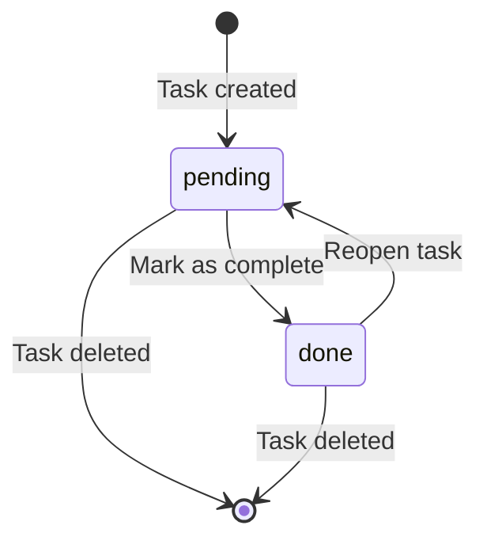

# Data Model: Task CRUD Operations

**Feature**: 001-task-crud
**Date**: 2026-01-06
**Status**: Final

## Overview

This document defines the data structures and validation rules for the Terminal To-Do App, ensuring type safety and data integrity throughout the application.

## Core Types

### Task

Represents a single todo item with complete lifecycle information.

```typescript
interface Task {
  /** Unique numeric identifier (auto-generated, immutable) */
  id: number

  /** Task description (1-1000 characters, required) */
  description: string

  /** Current task status */
  status: TaskStatus

  /** ISO 8601 timestamp of task creation (immutable) */
  created_at: string

  /** ISO 8601 timestamp of last modification (null if never updated) */
  updated_at: string | null
}
```

### TaskStatus

Enumeration of valid task states.

```typescript
type TaskStatus = 'pending' | 'done'
```

### TaskList

Root container for all tasks in storage.

```typescript
interface TaskList {
  /** Schema version for backward compatibility */
  version: string

  /** Array of all tasks, sorted by creation date (newest first) */
  tasks: Task[]
}
```

### TaskInput

Input type for creating new tasks (excludes auto-generated fields).

```typescript
interface TaskInput {
  description: string
}
```

### TaskUpdate

Input type for updating existing tasks (all fields optional).

```typescript
interface TaskUpdate {
  description?: string
  status?: TaskStatus
}
```

## Validation Rules

### Task Validation

| Field | Type | Required | Min | Max | Pattern | Rules |
|-------|------|----------|-----|-----|---------|-------|
| id | number | Yes | 1 | ∞ | Integer | Auto-generated, unique, immutable |
| description | string | Yes | 1 | 1000 | Any printable | Trim whitespace, no validation errors |
| status | string | Yes | - | - | pending\|done | Default: "pending" |
| created_at | string | Yes | - | - | ISO 8601 | Auto-generated, immutable |
| updated_at | string\|null | No | - | - | ISO 8601\|null | Auto-set on update |

### TaskList Validation

| Field | Type | Required | Default | Rules |
|-------|------|----------|---------|-------|
| version | string | Yes | "1.0" | Must match current schema version |
| tasks | array | Yes | [] | No duplicate IDs, sorted newest first |

## State Transitions

### Task Status State Machine



**Valid Transitions**:
- `pending` → `done` (mark task as complete)
- `done` → `pending` (reopen task)

**Invalid Transitions** (must be prevented):
- Direct status changes bypassing validation
- Status changes without updating `updated_at`

## Business Rules

### ID Generation (FR-002)

1. IDs are sequential integers starting from 1
2. IDs are never reused (even after deletion)
3. Next ID = max(existing IDs) + 1, or 1 if no tasks exist

```typescript
function generateNextId(tasks: Task[]): number {
  if (tasks.length === 0) return 1
  return Math.max(...tasks.map(t => t.id)) + 1
}
```

### Duplicate Handling (FR-003)

- Task descriptions may be duplicated
- Each duplicate gets a unique ID
- No deduplication or merging logic

### Timestamp Rules (FR-004)

- `created_at`: Set once at task creation, never modified
- `updated_at`: Set to `null` on creation, updated to ISO timestamp on any modification
- Format: ISO 8601 with timezone (e.g., `2026-01-06T12:00:00Z`)

### Sorting (US2 Acceptance Scenario 4)

Tasks are displayed with newest first (descending `created_at`):

```typescript
function sortTasks(tasks: Task[]): Task[] {
  return [...tasks].sort((a, b) =>
    new Date(b.created_at).getTime() - new Date(a.created_at).getTime()
  )
}
```

## Error Scenarios

### Invalid Data States

| Scenario | Error | Recovery |
|----------|-------|----------|
| Duplicate task ID | `ValidationError: Duplicate task ID: {id}` | Reject write, log error |
| Invalid status | `ValidationError: Invalid status: {status}` | Default to "pending" |
| Missing description | `ValidationError: Description is required` | Reject operation |
| Description > 1000 chars | `ValidationError: Description too long (max 1000)` | Truncate or reject |
| Invalid timestamp | `ValidationError: Invalid timestamp format` | Reject read, try backup |
| Corrupted JSON | `ParseError: Invalid JSON in data file` | Restore from backup if available |
| Version mismatch | `VersionError: Unsupported schema version: {v}` | Attempt migration or reject |

### Edge Case Handling (from Spec)

| Edge Case | Strategy |
|-----------|----------|
| Corrupted JSON file | Try backup, else start with empty TaskList |
| Concurrent access | Last write wins (acceptable per constitution) |
| Keyboard interrupt during write | Atomic rename prevents corruption |
| Special characters in description | Store as-is in JSON (UTF-8 encoded) |
| Missing storage directory | Create recursively with `mkdir -p` |
| Out of disk space | Catch write error, display user-friendly message |
| Manually edited duplicate IDs | Validate on load, reject if found |

## TypeScript Implementation

### File: src/models/Task.ts

```typescript
/**
 * Valid task status values
 */
export type TaskStatus = 'pending' | 'done'

/**
 * Complete task data structure
 */
export interface Task {
  id: number
  description: string
  status: TaskStatus
  created_at: string
  updated_at: string | null
}

/**
 * Input for creating a new task
 */
export interface TaskInput {
  description: string
}

/**
 * Input for updating an existing task
 */
export interface TaskUpdate {
  description?: string
  status?: TaskStatus
}

/**
 * Root storage container
 */
export interface TaskList {
  version: string
  tasks: Task[]
}

/**
 * Validation error class
 */
export class ValidationError extends Error {
  constructor(
    public field: string,
    message: string
  ) {
    super(`Validation error for ${field}: ${message}`)
    this.name = 'ValidationError'
  }
}

/**
 * Validate task input
 */
export function validateTaskInput(input: TaskInput): void {
  if (!input.description || input.description.trim().length === 0) {
    throw new ValidationError('description', 'Description is required')
  }

  if (input.description.length > 1000) {
    throw new ValidationError('description', 'Description too long (max 1000 characters)')
  }
}

/**
 * Validate task status
 */
export function validateTaskStatus(status: string): asserts status is TaskStatus {
  if (status !== 'pending' && status !== 'done') {
    throw new ValidationError('status', `Invalid status: ${status}`)
  }
}

/**
 * Generate next unique ID
 */
export function generateNextId(tasks: Task[]): number {
  if (tasks.length === 0) return 1
  return Math.max(...tasks.map(t => t.id)) + 1
}

/**
 * Check for duplicate task IDs
 */
export function validateUniqueIds(tasks: Task[]): void {
  const ids = new Set(tasks.map(t => t.id))
  if (ids.size !== tasks.length) {
    throw new ValidationError('id', 'Duplicate task IDs detected')
  }
}

/**
 * Sort tasks by creation date (newest first)
 */
export function sortTasksByCreated(tasks: Task[]): Task[] {
  return [...tasks].sort((a, b) =>
    new Date(b.created_at).getTime() - new Date(a.created_at).getTime()
  )
}
```

## Schema Evolution

### Version 1.0 (Current)

- Basic task CRUD operations
- Status: pending/done
- Timestamps for creation and updates

### Future Considerations (Out of Scope per Spec)

If adding features in future versions:
- Version 2.0: Add priority field
- Version 3.0: Add due dates
- Version 4.0: Add categories/tags

Each version must:
1. Update `version` string in TaskList
2. Provide migration function from previous version
3. Maintain backward compatibility during read
4. Validate before writing new version
